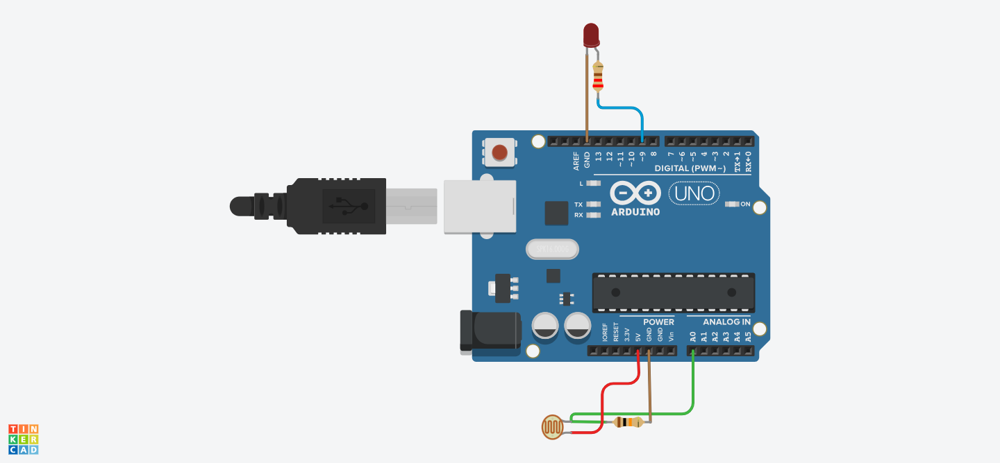

# Arduino Analog Sensor Control Project

## Project Overview

This project demonstrates analog input/output control using an Arduino Uno. It reads analog values from a sensor (potentiometer) and uses that input to control the brightness of an LED through PWM (Pulse Width Modulation). The system also provides real-time serial monitoring of sensor values.

open in [Tinkercad](https://www.tinkercad.com/things/cIvRICwDLKe-brave-snicket)

## Features

- **Analog Input Reading**: Reads analog values from pin A0
- **PWM Output Control**: Controls LED brightness on digital pin 9
- **Serial Communication**: Real-time monitoring of sensor values via Serial Monitor
- **Latching Power Switch Circuit**: Includes auto power on/off functionality
- **Digital and Analog Sensor Integration**: Supports both sensor types

## Hardware Requirements

### Components Needed:
- Arduino Uno R3
- 1x Potentiometer (10kΩ recommended)
- 1x LED (any color)
- 1x Current limiting resistor (220Ω - 470Ω for LED)
- Jumper wires
- Breadboard
- USB cable for programming and power

### Circuit Connections:

#### Potentiometer (Analog Sensor):
- **Left pin**: Connect to 5V (Arduino)
- **Center pin**: Connect to A0 (Arduino analog input)
- **Right pin**: Connect to GND (Arduino)

#### LED Circuit:
- **LED Anode (+)**: Connect to Digital Pin 9 through current limiting resistor
- **LED Cathode (-)**: Connect to GND (Arduino)

#### Power Connections:
- **5V**: Power supply for potentiometer
- **GND**: Common ground for all components

## Software Requirements

- Arduino IDE (version 1.8.0 or higher)
- USB driver for Arduino Uno (usually auto-installed)

## Installation and Setup

### 1. Hardware Assembly:
1. Connect the potentiometer to A0, 5V, and GND as specified
2. Connect the LED with current limiting resistor to pin 9 and GND
3. Verify all connections match the circuit diagram

### 2. Software Upload:
1. Open Arduino IDE
2. Copy and paste the provided code
3. Select the correct board: **Tools > Board > Arduino Uno**
4. Select the correct port: **Tools > Port > [Your Arduino Port]**
5. Click **Upload** to flash the code to Arduino

### 3. Testing:
1. Open Serial Monitor (Tools > Serial Monitor or Ctrl+Shift+M)
2. Set baud rate to **9600**
3. Rotate the potentiometer and observe:
   - LED brightness changes
   - Serial Monitor displays sensor values

## How It Works

1. When light hits the LDR, its resistance changes.
2. This change is read as a voltage at A0 and converted to a digital value by the ADC.
3.The LED brightness varies proportionally with the light level—brighter environment means higher PWM value and brighter LED.

## Troubleshooting

### Common Issues:

| Problem | Possible Cause | Solution |
|---------|---------------|----------|
| LED doesn't light | Wrong polarity or no current limiting resistor | Check LED orientation and add resistor |
| No serial output | Wrong baud rate or port | Set Serial Monitor to 9600 baud |
| Erratic readings | Loose connections | Check all wire connections |
| LED too dim/bright | Wrong resistor value | Adjust resistor value (220Ω-470Ω) |

